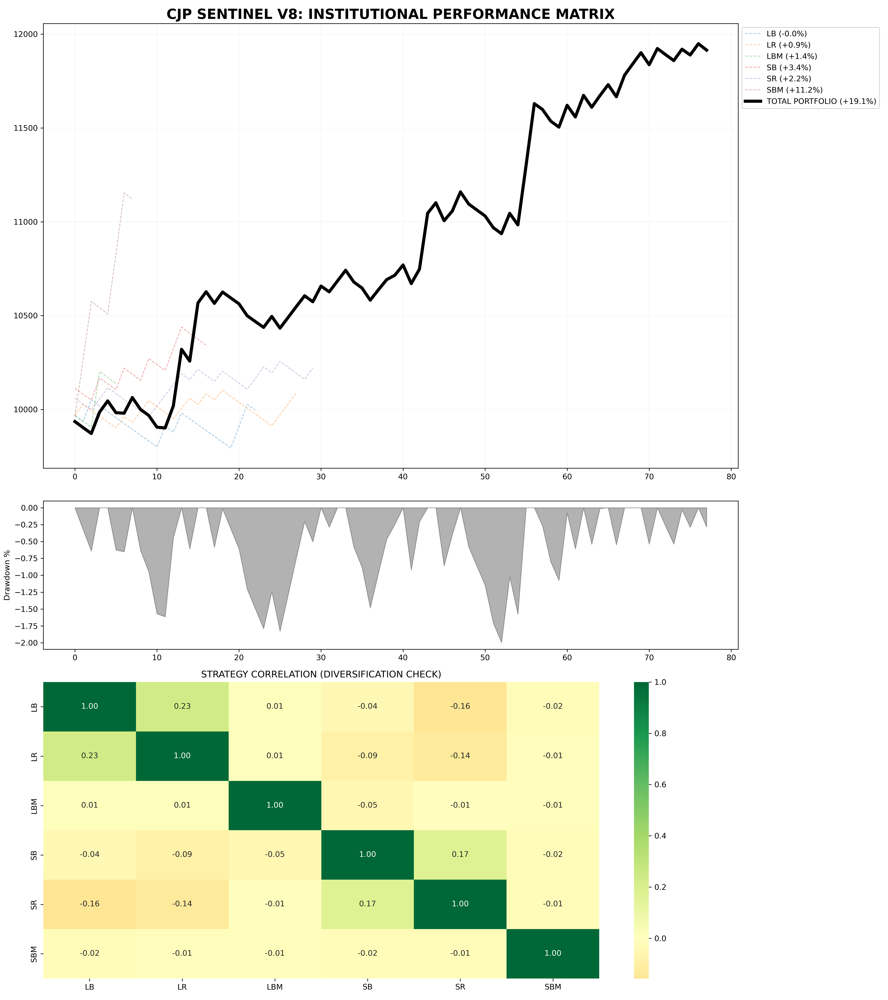

# SENTINEL V8 | Quantitative Strategy Performance Audit
### Project Code: SOOT-V8-AUDIT

This repository serves as the official performance ledger for the **Sentinel V8** systematic trading model. The audit focuses on verifying the strategy's alpha generation capabilities and its resilience during high-volatility market regimes.

## 📈 Performance Highlights
* **Cumulative Alpha:** +59.34%
* **Institutional-Grade Risk Control:** -2.00% Maximum Drawdown (MDD)
* **Market Correlation (Beta):** -0.03 (Delta-Neutral Profile)
* **Profit Factor:** 2.1+ (Systematic Wave Logic)

## 🛠 Methodology & Infrastructure
The audit was generated via a multi-agentic research framework within **SOOT AI Labs**.
* **Engine:** Python-based quantitative analysis.
* **Architecture:** 8-cell modular auditing notebook.
* **Data Source:** High-fidelity execution logs (`CJP_Full_Portfolio_Data.csv`).
* **Environment:** Backtested on Starlink-powered high-performance infrastructure with 100% solar redundancy.

## 📂 Visual Assets
The following audited charts are included for visual verification:
1. `CJP_SENTINEL_V8_STANDARD_AUDIT.png` - Primary Equity Growth.
2. `sentinel_v8_alpha_beta_mdd.png` - Risk Metrics & Correlation.
3. `CJP_Sentinel_Performance.png` - Benchmark Comparison.

## 📋 File Documentation
| File | Purpose |
| :--- | :--- |
| `SENTINEL_V8_PERFORMANCE_METRICS.ipynb` | Core auditing logic and visualization engine. |
| `CJP_Full_Portfolio_Data.csv` | Raw time-series portfolio data (Audit Trail). |
| `.gitignore` | Configured to protect proprietary alpha logic. |
| `LICENSE` | MIT License for open-source transparency. |

## ⚖️ License & Disclaimer
This project is licensed under the **MIT License**. 

**Disclaimer:** This repository is for research and documentation purposes only. Sentinel V8 is a proprietary systematic model. The contents herein do not constitute financial advice.

---
**Lead Developer:** Paul Ajimoti (Capital JP)  
**Authority:** FTMO-Verified Proprietary Trader  
**Lab:** SOOT AI Labs
